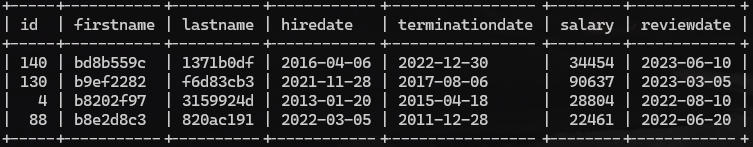
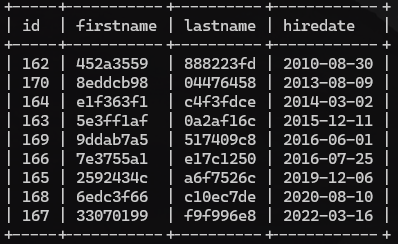
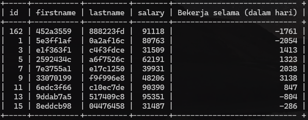

# Test

## Studi Kasus SQL Script

1

- A. Employee Table

```sql
CREATE TABLE Employee (
     ID int NOT NULL AUTO_INCREMENT,
     FirstName varchar(100) NOT NULL,
     LastName varchar(100) NOT NULL,
     HireDate date NOT NULL,
     TerminationDate date DEFAULT NULL,
     Salary int NOT NULL,
     PRIMARY KEY (ID)
     ) ENGINE=InnoDB;
```

- B. AnnualReviews Table

```sql
CREATE TABLE AnnualReviews (
    ID int NOT NULL,
    EmpID int NOT NULL,
    ReviewDate date DEFAULT NULL,
    PRIMARY KEY (ID),
    KEY FK_EmployeeAnnualReviews (EmpID),
    CONSTRAINT FK_EmployeeAnnualReviews FOREIGN KEY (EmpID) REFERENCES Employee (ID)
    ) ENGINE=InnoDB;
```

2

```sql
SELECT employee.id, employee.firstname, employee.lastname, employee.hiredate, employee.terminationdate, employee.salary, annualreviews.reviewdate
FROM employee
JOIN annualreviews ON (employee.id = annualreviews.empid) WHERE employee.firstname LIKE 'B%' 
ORDER BY annualreviews.reviewdate DESC;
```



3

```sql
SELECT annualreviews.id, employee.firstname, employee.lastname, employee.hiredate 
FROM annualreviews 
JOIN employee ON (annualreviews.empid = employee.id) WHERE annualreviews.reviewdate IS NULL 
ORDER BY hiredate;
```



4

```sql
SELECT employee.id, employee.firstname, employee.lastname, employee.salary, DATEDIFF(employee.hiredate, employee.terminationdate) AS 'Bekerja selama (dalam hari)' 
FROM employee 
JOIN annualreviews ON (employee.id = annualreviews.empid)
WHERE annualreviews.reviewdate IS NULL;
```



---

## Studi Kasus Shell Script Programming

```bash
#!/bin/bash

echo "Input:"
read n

if ! [[ "$n" =~ ^[0-9]+$ && "$n" -gt 0 ]]; then
    echo "Input harus bilangan positif."
    exit 1
fi

fibonacci() {
    local num=$1
    if [ $num -eq 0 ]; then
        echo 0
    elif [ $num -eq 1 ]; then
        echo 1
    else
        local a=0
        local b=1
        for ((i = 2; i <= num; i++)); do
            local next=$((a + b))
            a=$b
            b=$next
        done
        echo $b
    fi
}

echo "Fibonacci dari $n adalah"
for ((i = 0; i < n; i++)); do
    echo -n "$(fibonacci $i) "
done

echo

```

- Menerima input dari user
- Cek apakah input valid
- Baru lakukan fungsi fibonacci

---

## Dasar Data Engineer

1. Data Engineer bertugas untuk mengelola data, bertanggung jawab untuk membangun dan mengelola infrastruktur data yang dapat menampung, memproses, dan menganalisis data dari berbagai sumber.

2. - Mengumpulkan data dari berbagai sumber.
   - Membangun data pipeline yang mudah diakses dan dipahami oleh semua pengguna data.
   - Memastikan kebijakan tata kelola dan keamanan data sesuai dengan standar perusahaan.
   - Membersihkan dan menstandarisasi data untuk menghilangkan noise, outlier, atau kesalahan.
   - Mengubah data menjadi informasi yang berguna dan dapat dimanfaatkan untuk decision making.
   - Berkolaborasi dengan manajemen untuk memahami tujuan perusahaan dan memberikan solusi data yang sesuai.

3. Data modelling adalah proses membuat skema atau diagram yang menggambarkan hubungan antara berbagai jenis data yang akan disimpan dalam database.

4. - Model Konseptual adalah jenis model data yang menggambarkan penggunaan sebenarnya. Contoh model konseptual adalah ERD yang menggambarkan Entitas, Atribut dan Relasi dalam sebuah sistem.
   - Model Logis adalah jenis model data yang menambahkan lebih banyak detail seperti atribut, kunci dan normalisasi.
   - Model Fisik adalah jenis model data yang menentukan bagaimana data disimpan secara fisik dalam database, termasuk indeks, partisi, dan konstrain.

5. - Integrate.io
   1. Kode rendah dan tanpa kode.
   2. Drag and drop control.
   3. Hybrid and multi - cloud support
   4. API connection
   5. Data lake compatibility
   - Talend
   1. Drag and drop control.
   2. Hybrid and multi-cloud support.
   3. Data quality and governance.
   4. Machine learning capabilities.
6. - SQL
   - Python
   - Java
   - Scala
